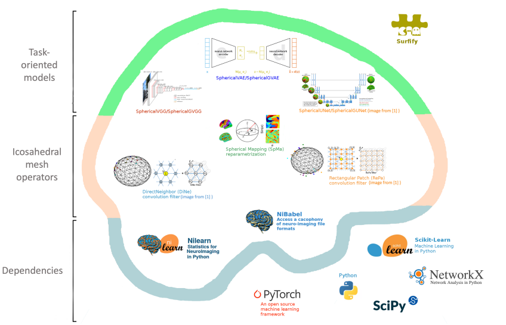

.. -*- mode: rst -*-

|PythonVersion|_ |Coveralls|_ |Testing|_ |Pep8|_ |Doc|_ |PyPi|_

.. |PythonVersion| image:: https://img.shields.io/badge/python-3.9%20%7C%203.8%20%7C%203.12-blue
.. _PythonVersion: https://img.shields.io/badge/python-3.9%20%7C%203.8%20%7C%203.12-blue

.. |Coveralls| image:: https://coveralls.io/repos/neurospin-deepinsight/surfify/badge.svg?branch=master&service=github
.. _Coveralls: https://coveralls.io/github/neurospin-deepinsight/surfify

.. |Testing| image:: https://github.com/neurospin-deepinsight/surfify/actions/workflows/testing.yml/badge.svg
.. _Testing: https://github.com/neurospin-deepinsight/surfify/actions

.. |Pep8| image:: https://github.com/neurospin-deepinsight/surfify/actions/workflows/pep8.yml/badge.svg
.. _Pep8: https://github.com/neurospin-deepinsight/surfify/actions

.. |Doc| image:: https://github.com/neurospin-deepinsight/surfify/actions/workflows/documentation.yml/badge.svg
.. _Doc: http://neurospin-deepinsight.github.io/surfify

.. |PyPi| image:: https://badge.fury.io/py/surfify.svg
.. _PyPi: https://badge.fury.io/py/surfify

surfify: Deep Learning Spherical Toolbox
========================================

\:+1: If you are using the code please add a star to the repository :+1:

PyTorch toolbox to work with brain spherical surfaces.

This work is made available by a `community of people <./AUTHORS.rst>`_, amoung which the CEA Neurospin BAOBAB laboratory.

Important links
---------------

- `Official source code repo <https://github.com/neurospin-deepinsight/surfify>`_
- `HTML documentation <https://neurospin-deepinsight.github.io/surfify>`_
- `Release notes <./CHANGELOG.rst>`_

Content
-------

Define different spherical convolution strategies, namely:

* RePa: Rectangular Patch convolution method.
* DiNe: Direct Neighbor convolution method.
* SpMa: Spherical Mapping convolution method.

.. code::

  @article{zhao2019dine,
        title={Spherical U-Net on Cortical Surfaces: Methods and Applications}, 
        author={Fenqiang Zhao and Shunren Xia and Zhengwang Wu and Dingna Duan and Li Wang and Weili Lin and John H Gilmore and Dinggang Shen and Gang Li},
        journal={IPMI},
        year={2019}
  }

  @article{seong2018repa,
        title={Geometric convolutional neural network for analyzing surface-based neuroimaging data}, 
        author={Seong, Si-Baek and Pae, Chongwon and Park, Hae-Jeong},
        journal={Frontiers in Neuroinformatics},
        year={2018}
  }

  @article{kim2021vae,
        author = {Jung-Hoon Kim and Yizhen Zhang and Kuan Han and Zheyu Wen and Minkyu Choi and Zhongming Liu},
        title = {Representation learning of resting state fMRI with variational autoencoder},
        journal = {NeuroImage},
        volume = {241},
        pages = {118423},
        year = {2021}
  }

Brain cortical augmentations:

* SurfCutOut, SurfNoise, SurfRotation, SurfBlur.
* HemiMixUp: Random permutation of a subject's measurements at specific vertices
  across hemispheres.
* GroupMixUp: Random bootstraping of measures at specific vertices across a
  group of K subjects.

.. code::

  @inproceedings{ambroise2023cl,
    title = {MixUp Brain-Cortical Augmentations in Self-supervised Learning},
    author= {Corentin Ambroise and
             Vincent Frouin and
             Benoit Dufumier and
             Edouard Duchesnay and
             Antoine Grigis},
    booktitle = {MLCN},
    series = {Lecture Notes in Computer Science},
    volume = {14312},
    pages  = {102--111},
    publisher = {Springer},
    year  = {2023},
    doi = {10.1007/978-3-031-44858-4\_10}
  }

Surface vision transformer rountines:

* patch_tri: icosahedron multi-resolution triangular patch strategy.

.. code::

    @inproceedings{dahan2022sit,
      title = {Surface Vision Transformers: Attention-Based Modelling applied to Cortical Analysis},
      author = {Dahan, Simon and Fawaz, Abdulah and Williams, Logan Z. J. and Yang, Chunhui and Coalson, Timothy S. and Glasser, Matthew F. and Edwards, A. David and Rueckert, Daniel and Robinson, Emma C.},
      booktitle = {MIDL},
      pages = {282--303},
      year = {2022},
      volume = {172},
      series = {Proceedings of Machine Learning Research},
    }

    @misc{dahan2024mssit,
      title = {The Multiscale Surface Vision Transformer}, 
      author = {Simon Dahan and Logan Z. J. Williams and Daniel Rueckert and Emma C. Robinson},
      year = {2024},
      eprint={2303.11909},
      archivePrefix={arXiv}
    }
 
Where to start
--------------

Examples are available in the `gallery <https://neurospin-deepinsight.github.io/surfify/auto_gallery/index.html>`_. You can also refer to the `API documentation <https://neurospin-deepinsight.github.io/surfify/generated/documentation.html>`_.

Install
-------

The code has been developed for PyTorch version 1.8.1 and torchvision version 0.9.1, but should work with newer versions as well. Make sure you have installed all the package dependencies. Complete instructions are available `here <https://neurospin-deepinsight.github.io/surfify/generated/installation.html>`_.

Contributing
------------

If you want to contribute to surfify, be sure to review the `contribution guidelines <./CONTRIBUTING.rst>`_.

License
-------

This project is under the following `LICENSE <./LICENSE.rst>`_.

