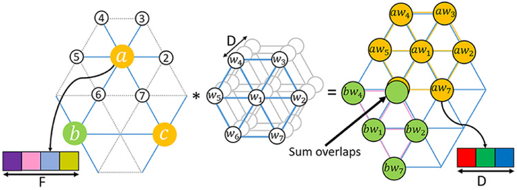

.. -*- mode: rst -*-

|PythonVersion|_ |Coveralls|_ |Testing|_ |Pep8|_ |PyPi|_ |Doc|_

.. |PythonVersion| image:: https://img.shields.io/badge/python-3.7%20%7C%203.8%20%7C%203.9-blue
.. _PythonVersion: https://img.shields.io/badge/python-3.7%20%7C%203.8%20%7C%203.9-blue

.. |Coveralls| image:: https://coveralls.io/repos/neurospin-deepinsight/surfify/badge.svg?branch=master&service=github
.. _Coveralls: https://coveralls.io/github/neurospin-deepinsight/surfify

.. |Testing| image:: https://github.com/neurospin-deepinsight/surfify/actions/workflows/testing.yml/badge.svg
.. _Testing: https://github.com/neurospin-deepinsight/surfify/actions

.. |Pep8| image:: https://github.com/neurospin-deepinsight/surfify/actions/workflows/pep8.yml/badge.svg
.. _Pep8: https://github.com/neurospin-deepinsight/surfify/actions

.. |PyPi| image:: https://badge.fury.io/py/surfify.svg
.. _PyPi: https://badge.fury.io/py/surfify

.. |Doc| image:: https://readthedocs.org/projects/surfify/badge/?version=latest
.. _Doc: https://surfify.readthedocs.io/en/latest/?badge=latest

surfify: Deep Learning Spherical Toolbox
========================================

\:+1: If you are using the code please add a star to the repository :+1:

PyTorch toolbox to work with spherical surfaces.
Define different spherical convolution strategies, namely:

* RePa: Rectangular Patch convolution method.
* DiNe: Direct Neighbor convolution method.
* SpMa: Spherical Mapping convolution method.

.. code::

  @article{zhao2019dine,
        title={Spherical U-Net on Cortical Surfaces: Methods and Applications}, 
        author={Fenqiang Zhao and Shunren Xia and Zhengwang Wu and Dingna Duan and Li Wang and Weili Lin and John H Gilmore and Dinggang Shen and Gang Li},
        journal={IPMI},
        year={2019}
  }

  @article{seong2018repa,
        title={Geometric convolutional neural network for analyzing surface-based neuroimaging data}, 
        author={Seong, Si-Baek and Pae, Chongwon and Park, Hae-Jeong},
        journal={Frontiers in Neuroinformatics},
        year={2018}
  }

  @article{kim2021vae,
        author = {Jung-Hoon Kim and Yizhen Zhang and Kuan Han and Zheyu Wen and Minkyu Choi and Zhongming Liu},
        title = {Representation learning of resting state fMRI with variational autoencoder},
        journal = {NeuroImage},
        volume = {241},
        pages = {118423},
        year = {2021}
  }

This work is made available by a `community of people
<https://github.com/neurospin-deepinsight/surfify/blob/master/AUTHORS.rst>`_, amoung which the
CEA Neurospin BAOBAB laboratory.

    
.. image:: ./doc/source/_static/carousel/nihms-1568058-f0006.jpg
    :width: 400px
    :align: center
    
Important links
===============

- `Official source code repo <https://github.com/neurospin-deepinsight/surfify>`_
- `HTML stable documentation <https://surfify.readthedocs.io/en/v0.1.0>`_
- `HTML documentation <https://surfify.readthedocs.io/en/latest>`_
- `Release notes <https://github.com/neurospin-deepinsight/surfify/blob/master/CHANGELOG.rst>`_

Where to start
==============

Examples are available in the
`gallery <https://surfify.readthedocs.io/en/latest/auto_gallery/index.html>`_.
You can also refer to the
`API documentation <https://surfify.readthedocs.io/en/latest/generated/documentation.html>`_.

Install
=======

The code has been developed for PyTorch version 1.8.1 and torchvision
version 0.9.1, but should work with newer versions as well.
Make sure you have installed all the package dependencies.
Complete instructions are available `here
<https://surfify.readthedocs.io/en/latest/generated/installation.html>`_.

License
=======

This project is under the following
`LICENSE <https://github.com/neurospin-deepinsight/surfify/blob/master/LICENSE.rst>`_.

